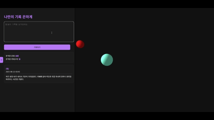
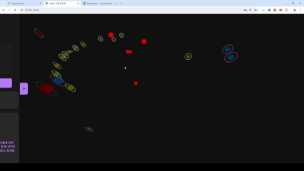

# 프로젝트 개요: 나만의 기록 은하계 (가칭)

---

## 1. 프로젝트 소개
본 프로젝트는 사용자가 작성한 기록을 시각적으로 관리하고 탐색하는 인터랙티브 웹 애플리케이션입니다.  
기존의 선형적인 기록 관리 방식을 벗어나, 기록의 내용, 중요도, 그리고 관계에 따라 동적으로 변화하는 은하계 형태의 시각화를 제공합니다.  
사용자는 기록 별들의 움직임과 그룹화를 통해 자신의 생각과 아이디어 사이의 숨겨진 연결고리를 발견할 수 있습니다.

---

## 2. 주요 기능
- **기록 생성 및 관리**  
  사용자는 자유롭게 텍스트 기록을 생성하고 편집할 수 있으며, 각 기록은 하나의 '별'로 표현됩니다.
  
  

- **시각적 은하계**  
  기록 '별'들은 '별자리'와 '은하계'라는 계층적 구조를 형성하며, 이 구조는 기록 간의 중력 상호작용에 의해 동적으로 변화합니다.

- **계층적 인력자 (Attractors)**  
  - **별자리 (Constellation):** 비슷한 주제의 기록들이 모여 하나의 별자리를 형성하며, 별자리는 그 안의 별들을 끌어당기는 인력자입니다.  
  - **은하계 (Galaxy):** 모든 별자리들이 모여 하나의 은하계를 이루며, 전체 기록들을 하나로 묶는 가장 큰 인력자 역할을 합니다.
  
  

- **인터랙티브 탐색**  
  사용자는 마우스 휠로 확대/축소하거나 드래그하여 시각화된 은하계를 자유롭게 탐색할 수 있습니다.

---

## 3. 기술 스택
- **프론트엔드:** HTML, CSS, JavaScript, Three.js
- **백엔드:** Python,Flask
- **데이터베이스:** googlesheet

---

## 4. 기대 효과
- **새로운 기록 관리 경험**  
  단순한 목록형 기록 관리에서 벗어나, 직관적이고 시각적인 방식으로 기록을 탐색할 수 있습니다.

- **창의성 증진**  
  기록 간의 관계를 시각적으로 보여줌으로써 새로운 아이디어를 얻거나 창의적인 사고를 자극할 수 있습니다.

- **효율적인 정보 접근**  
  방대한 기록 속에서도 원하는 정보를 빠르고 쉽게 찾을 수 있어 생산성이 향상됩니다.
